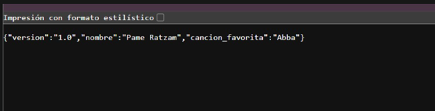
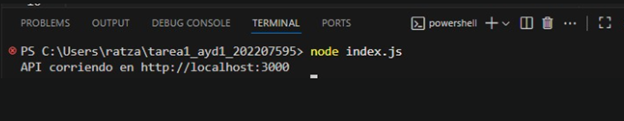
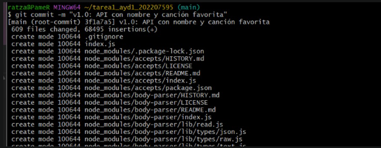
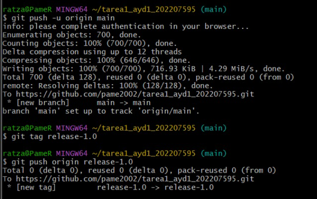
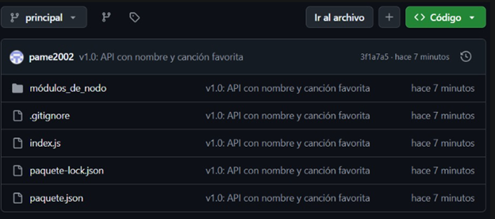
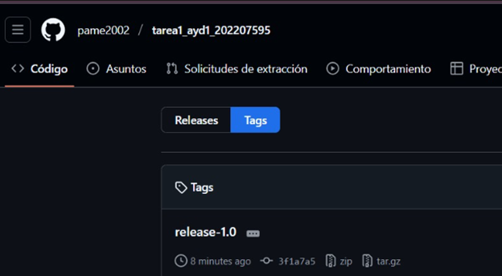
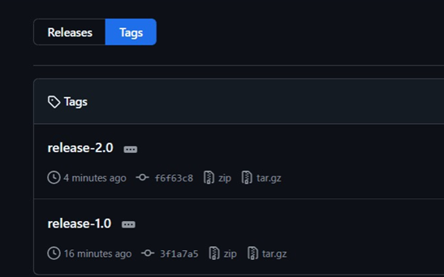
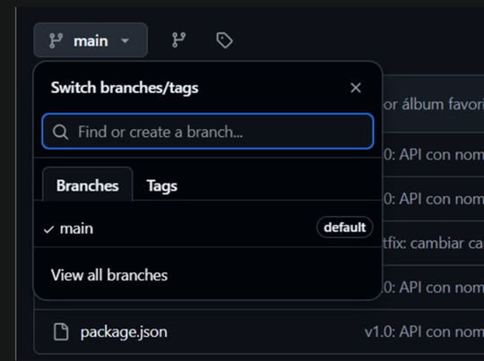

# Tarea 1 – Repositorios públicos y tags

**Nombre:** Pamela Ratzam  
**Carné:** 202207595

## API con canción favorita

La API inicial devuelve el nombre y la canción favorita en formato JSON.

## API corriendo

Se muestra la ejecución de la API en el servidor local, escuchando en el puerto 3000.

## Commit inicial (v1.0)

Se registra el primer commit con el código base de la API en la rama main.

## Push inicial y creación del tag release-1.0

Se sube el proyecto a GitHub y se marca la versión inicial con el tag release-1.0.

## Cambios en el repositorio

Se observan los cambios reflejados en GitHub después del push inicial.

## Creación de la rama hotfix

Se crea una rama de corrección llamada hotfix para modificar la API.

)

## Cambio en la API

La API ahora muestra el álbum favorito en lugar de la canción favorita.

)

## Integración de la rama hotfix

Se hace merge de la rama hotfix hacia main para aplicar la corrección.

)

## Creación del tag release-2.0

Se marca la versión corregida de la API con el tag release-2.0.

)

## Eliminación de la rama hotfix

La rama hotfix es eliminada después de integrar y versionar los cambios.

